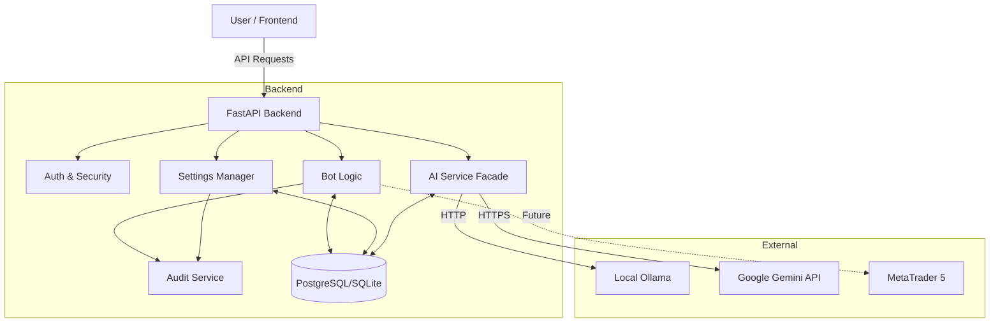

# System Data-Flow Overview

This document provides a functional overview of the data flow across the AI Trading OS system. It is designed to help understanding, debugging, and future expansion by identifying shared data paths, external dependencies, and integration points.

## 1. AI Engine (Chat & Intelligence)

The AI Engine handles all natural language interactions and intelligence tasks, managing failover between Local AI (Ollama) and Cloud AI (Gemini).

| Feature / Module | Input Data | Output Data | Source | Destination |
| :--- | :--- | :--- | :--- | :--- |
| **Chat Interface** (`/api/v1/chat/`) | User Message, Context Page, User ID | AI Response (Text), Token Usage, Model Used | User (UI) | Frontend / DB (`ai_messages`) |
| **AI Service Facade** (`ai_service.py`) | Prompt, Context Data, Preferred Provider | Generated Text / JSON | Chat Module / System Analysis | Ollama / Gemini / Frontend |
| **Local AI Connector** (`ollama_client.py`) | Prompt, System Prompt | Generated Text | AI Service | External API (`localhost:11434`) |
| **Cloud AI Connector** (`gemini_client.py`) | Prompt, API Key | Generated Text | AI Service | Google Gemini API |
| **Token Tracking** | Token Count per Request | Usage Stats (Daily/Monthly) | AI Service | DB (`ai_sessions`, `settings`) |

**Dependencies:**
- **Ollama**: Local instance running on port 11434.
- **Google Gemini API**: Requires valid API Key.
- **Database**: Stores `ai_sessions` and `ai_messages` for history context.

---

## 2. Bot & Trading Logic

This module manages the lifecycle, configuration, and execution rules of trading bots.

| Feature / Module | Input Data | Output Data | Source | Destination |
| :--- | :--- | :--- | :--- | :--- |
| **Bot Profile Management** | Name, Risk Profile, Strategy Type | Bot Configuration Object | User (UI) | DB (`bot_profiles`) |
| **Rule Engine** (`/api/v1/bots/{id}/rules`) | Indicators (RSI, Price), Operators, Thresholds | Saved Logic Rules | User (UI) | DB (`bot_rules`) |
| **Control Center** (`/api/v1/bots/{id}/{action}`) | Action (Start/Stop/Pause/Emergency) | New State, Success/Error Message | User (UI - Control Panel) | DB (`bot_profiles`) |
| **State Machine** | Current State, Requested Action | Validated New State | Control Center | DB / Audit Log |
| **Emergency Kill Switch** | "Stop All" Command | Stopped State for All Bots | User (UI - TopBar) | DB (`bot_profiles`) |

**Dependencies:**
- **Audit Service**: Logs all state changes and control actions for security.
- **Rate Limiter**: Prevents spamming control actions (e.g., rapid start/stop).

---

## 3. Settings & Configuration

Manages system-wide preferences, security credentials, and external connection configurations.

| Feature / Module | Input Data | Output Data | Source | Destination |
| :--- | :--- | :--- | :--- | :--- |
| **General Settings** | Risk Profile, Max Drawdown, News Sensitivity | Updated Settings Object | User (UI) | DB (`settings`) |
| **AI Configuration** | Provider Selection, API Keys, Model Selection | Sanitized Settings (No Keys), Connection Status | User (UI) | DB (`settings`) / AI Service |
| **Connection Tester** (`/api/v1/settings/test-ai`) | (Trigger) | Status (Connected/Error), Latency | User (UI) | DB (`settings`) / UI |
| **MT5 Configuration** | Server Address, Login ID, Account Type | Config Status (Mocked) | User (UI) | DB (`settings`) |

**Dependencies:**
- **Secret Management**: API Keys are stored in DB but **NEVER** returned in API responses.
- **Model Validation**: Validates local models against available Ollama tags.

---

## 4. Portfolio & Market Data

*Note: Currently partially simulated for MVP.*

| Feature / Module | Input Data | Output Data | Source | Destination |
| :--- | :--- | :--- | :--- | :--- |
| **Portfolio Overview** | Account ID | Balance, Equity, Margin, PnL | Mock/DB | Frontend (Dashboard) |
| **Trade History** | User/Bot ID, Limits | List of Historical Trades | DB (`trades`) | Frontend (History Page) |
| **MT5 Connection Test** | Server, Credentials | Mock Connection Result | User (UI) | UI (Immediate Feedback) |

---

## 5. Security & Audit

Ensures system integrity and tracks sensitive actions.

| Feature / Module | Input Data | Output Data | Source | Destination |
| :--- | :--- | :--- | :--- | :--- |
| **Audit Logging** | Action, User, Target ID, Result, IP | Log Entry | System Modules | DB (`audit_logs`) |
| **Rate Limiting** | User Request Frequency | Allow/Deny Decision | API Middleware | In-Memory / Redis (Future) |

## Data Flow Diagram (Conceptual)

## Critical Integration Points

1.  **AI Service Facade**: The central choke point for all AI calls. It handles the logic of "Try Local -> Fail -> Try Cloud". This is critical for reliability.
2.  **Settings Persistence**: The `Settings` table acts as the source of truth for API keys and configuration. Any change here propagates to the `AI Service` at runtime.
3.  **Bot State Machine**: Ensures integrity of bot operations (cannot start a running bot, etc.). This logic resides in the backend (`bots.py`) to prevent frontend desync.
